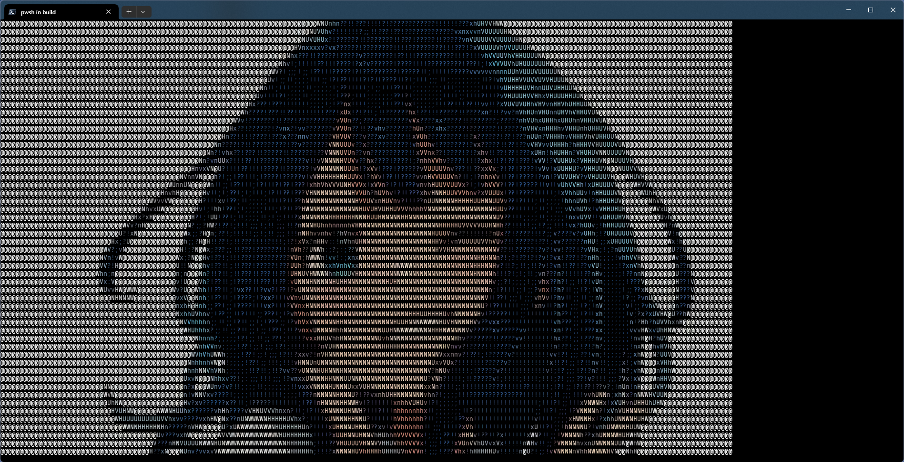
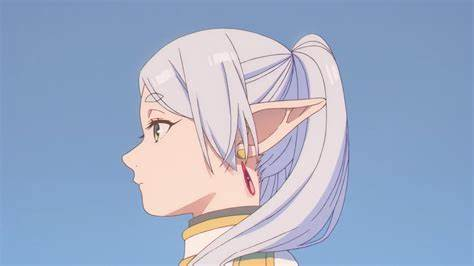
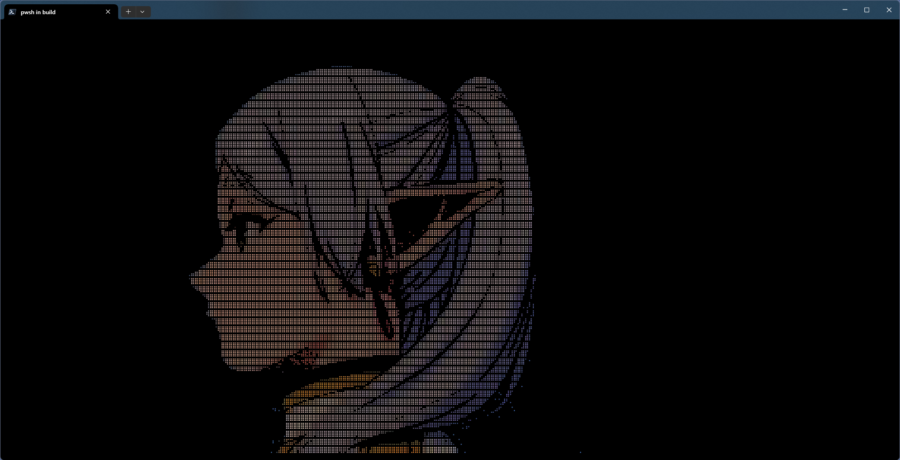
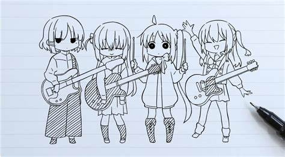
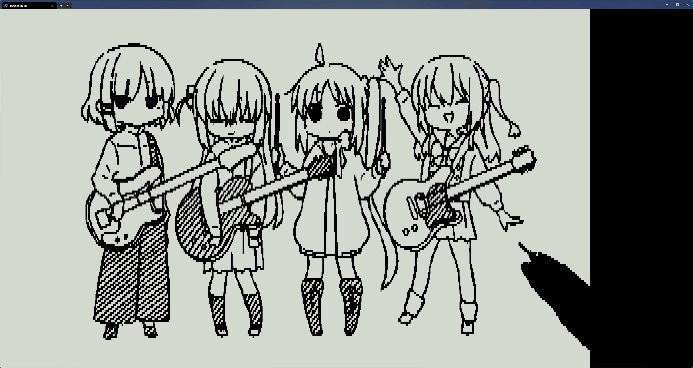

# AsciiArt -- An ASCII Art Generator

🎨 Generate ASCII character drawings from JPG or PNG images.

## Table of Contents

- [AsciiArt -- An ASCII Art Generator](#asciiart----an-ascii-art-generator)
  - [Table of Contents](#table-of-contents)
  - [Features](#features)
  - [Examples](#examples)
    - [block](#block)
    - [braille](#braille)
    - [block](#block-1)
  - [Build Instructions](#build-instructions)
    - [Windows](#windows)
    - [Linux](#linux)
  - [Usage](#usage)
    - [Options](#options)
  - [License](#license)

## Features

- Convert images to ASCII or unicode representation.
- Adjustable width and height for output.
- Support for color and alpha blending.
- Customizable grayscale and threshold settings.

## Examples

### block

Original Image:


Output:



### braille

Original Image:



Output:



### block

Original Image:



Output:



## Build Instructions

### Windows

To build the project on Windows, taking MinGW as an example, follow these steps:

```sh
mkdir build
cd .\build\
cmake -G "MinGW Makefiles"..
cmake --build .
```

### Linux

To build the project on Linux, use the following commands:

```sh
mkdir build
cd ./build
cmake ..
cmake --build .
```

## Usage

Run the ASCII Art generator with the following commands.

Linux:

```sh
asciiart -F filename [options]
```

Windows:

```sh
asciiart.exe -F filename [option]
```

### Options

| Option | Description |
|--------|-------------|
| `-F`   | Input filename (JPEG, PNG, or JFIF). |
| `-W`   | Max width (default is terminal width). |
| `-H`   | Max height (default is terminal height). |
| `-S`   | Output style: `ascii`, `braille` or 'block' (default is `ascii`). |
| `-N`   | Number of grayscale bits (default is 4, max is 4 for ASCII style only). |
| `-I`   | Ascii icons, default is `@`, ` @`, ` :#@`, ` :=xnHN@`, ` .:;!?vxnhVUHNW@` for different grayscale bits. The number of icons shorld equals to $2^N$."|
| `-C`   | Color hreshold value (default is 128 for Braille and Block style only). |
| `-A`   | Alpha hreshold value (default is 128 for Braille and Block style only). |
| `-G`   | Gamma value (default is 1.0). |
| `-c`   | Enable color output. |
| `-a`   | Enable transparency. |
| `-r`   | Enable gray reverse. |

## License

This project is licensed under the MIT License. See the [LICENSE](LICENSE) file for more details.
